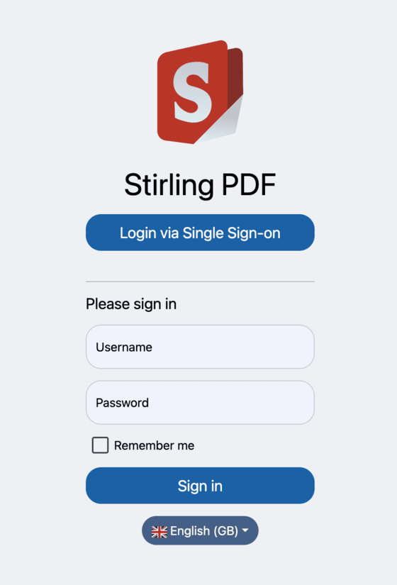
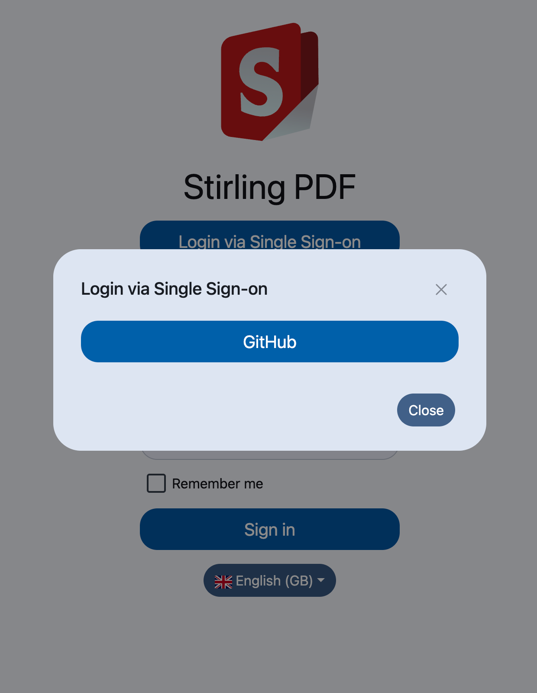
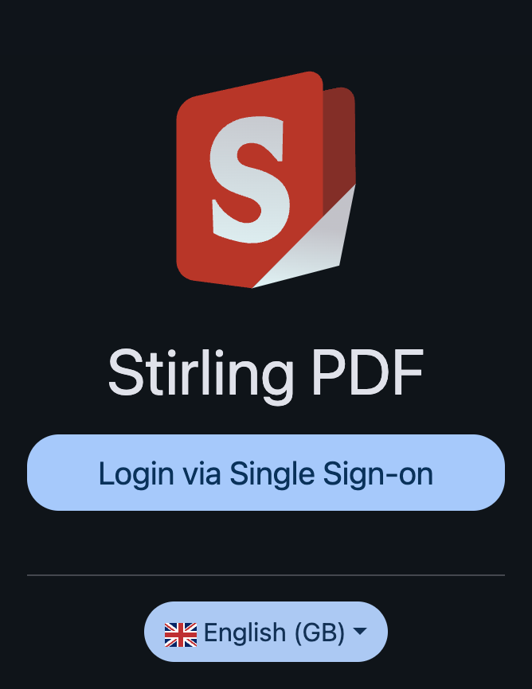
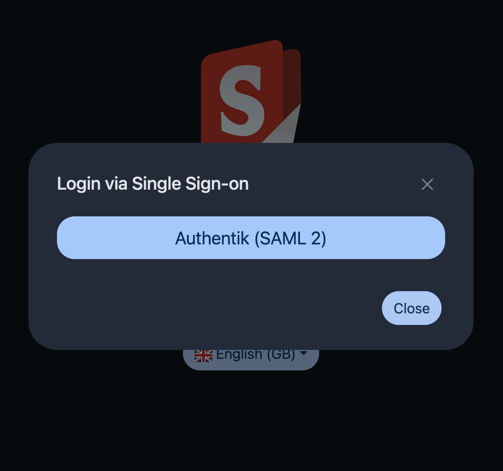

import Tabs from '@theme/Tabs';
import TabItem from '@theme/TabItem';

# Single Sign-On (SSO) Configuration

Stirling-PDF allows login via Single Sign-On (SSO) using OAuth 2 OpenID Connect (OIDC) and SAML 2. This allows you to log in to the
app using an account you may have with another Provider such as Google or GitHub.

## OAuth 2 Set Up
To enable OAuth 2 in Stirling-PDF there are a number of properties you must set. Begin by setting `security.enableLogin`
to `true` and `security.loginMethod` to `oauth2` in your `/configs/settings.yml`.

```yaml
security:
  enableLogin: true
  ...
  loginMethod: all | normal | oauth2 | saml2
```

- `enableLogin`: Set to `true` to enable login
- `loginMethod`: Defines the type of login method that will be used on application start up. The available options are:
  - `all`: Enables all login methods (username/password, OAuth 2, SAML 2). Can be used alternatively to `oauth2`
  - `normal`: Enables the username/password login method
  - `oauth2`: Enables the OAuth 2 login method. Use this if you only want to log in via OAuth 2
  - `saml2`: Enables the SAML 2 login method

Next, you will need to configure the OAuth 2 properties for your chosen Provider. Start by setting
`security.oauth2.enabled` to `true`. Stirling-PDF supports multiple Providers, in particular
[Google](https://console.cloud.google.com/), [GitHub](https://github.com/settings/developers) and [Keycloak](https://www.keycloak.org/).
You also have the option to use a different Provider apart from the aforementioned if you wish.

> #### ⚠️ Note
> _The `enableLogin` property must be set to `true` for SSO to work._

<Tabs groupId="provider-configs">
  <TabItem value="google" label="Google">
    ```yaml
    oauth2:
      enabled: true
      client:
        google:
          clientId: <YOUR_CLIENT_ID>
          clientSecret: <YOUR_CLIENT_SECRET>
          scopes: email, profile
          useAsUsername: email | name | given_name | family_name
      provider: google
    ```
  </TabItem>
  <TabItem value="github" label="GitHub">
    ```yaml
    oauth2:
      enabled: true
      client:
        github:
          clientId: <YOUR_CLIENT_ID>
          clientSecret: <YOUR_CLIENT_SECRET>
          scopes: read:user
          useAsUsername: email | login | name
      provider: github
    ```
  </TabItem>
  <TabItem value="keycloak" label="Keycloak">
    ```yaml
    oauth2:
      enabled: true
      client:
        keycloak:
          issuer: <YOUR_ISSUER_URI>
          clientId: <YOUR_CLIENT_ID>
          clientSecret: <YOUR_CLIENT_SECRET>
          scopes: openid, profile, email
          useAsUsername: email | preferred_name
      provider: keycloak
    ```
  </TabItem>
  <TabItem value="other" label="Other">
    _Using Authentik for example:_
    ```yaml
    oauth2:
      enabled: true
    issuer: <YOUR_ISSUER_URI>
    clientId: <YOUR_CLIENT_ID>
    clientSecret: <YOUR_CLIENT_SECRET>
    autoCreateUser: true
    blockRegistration: false
    useAsUsername: email | name | given_name | nickname | preferred_name
    scopes: openid, profile, email
    provider: authentik
    ```
  </TabItem>
</Tabs>

- `security.oauth2.enabled` Set this to `true` to enable login
- `security.oauth2.issuer` The URL for the Provider's OpenID Configuration. Set this to any Provider that supports an OpenID Connect Discovery `/.well-known/openid-configuration` endpoint
- `security.oauth2.clientId` Client ID from your Provider
- `security.oauth2.clientSecret` Client Secret from your Provider
- `security.oauth2.autoCreateUser` Set this to `true` to allow auto-creation of non-existing users
- `security.oauth2.blockRegistration`: Set to `true` to deny login with SSO without prior registration by an admin
- `security.oauth2.useAsUsername`: The value from the Provider to use as the username for the application. Check with your
Provider for specific options. The default is `email`
- `security.oauth2.scopes`: Specifies the list of scopes for which the application will request permissions. The available scopes
for Google and GitHub can be found [here](https://developers.google.com/identity/protocols/oauth2/scopes#oauth2) and
  [here](https://docs.github.com/en/apps/oauth-apps/building-oauth-apps/scopes-for-oauth-apps#available-scopes)
- `security.oauth2.provider`: The name of the Provider

The Callback URL (Redirect URL) for entering in your IdP is:  `https://<striling-pdf.yourdomain>/login/oauth2/code/<oidc-provider>` eg `https://<striling-pdf.yourdomain>/login/oauth2/code/keycloak`.
It is highly recommended to use an SSL-enabled reverse-proxy, if the application is going to be exposed to the internet.

After the OAuth 2 login is enabled, a new button will show up on the login page as per the screenshot below. Clicking the
'Login via Single Sign-On' button will present you with the login for your Provider of choice. Once you have clicked the button,
you will be redirected to your Provider in order to login and authorise Stirling-PDF to use your profile:

|  |  |
|-------------------------------------------------------------------------------------------------------------|----------------------------------------------------------------|

## SAML 2 Set Up

> #### ⚠️ Note
> _SAML 2 is an enterprise-only feature. To use it you must have `enterpriseEnabled` set to `true` and have a valid license key._

Begin by setting `security.enableLogin` to `true` and `security.loginMethod` to `saml2` in your `/configs/settings.yml`.

```yaml
saml2:
  enabled: true
  provider: <PROVIDER_NAME>
  autoCreateUser: true
  blockRegistration: false
  registrationId: <REGISTRATION_ID>
  idpMetadataUri: <PROVIDER_METADATA_URI>
  idpSingleLoginUrl: <PROVIDER_SSO_URL>
  idpSingleLogoutUrl: <PROVIDER_SLO_URL>
  idpIssuer: <PROVIDER_ISSUER_ID>
  idpCert: classpath:<PROVIDER_SELF-SIGNED_CERTIFICATE>
  privateKey: classpath:<YOUR_PRIVATE_KEY>
  spCert: classpath:<YOUR_CERTIFICATE>
```

- `security.saml2.enabled`: Set to `true` to activate SAML 2 SSO # Only enabled for paid enterprise clients (enterpriseEdition.enabled must be true)
- `security.saml2.autoCreateUser`: Set this to `true` to allow auto-creation of non-existing users
- `security.saml2.blockRegistration`: Set to `true` to deny login with SSO without prior registration by an admin
- `security.saml2.registrationId`: The registration ID for your Provider. Should match the name in the path for your
Assertion Consumer Service (ACS) URL The default is `stirling`
- `security.saml2.idpMetadataUri`: The location of the metadata file from your Provider. Can be a file or URI
- `security.saml2.idpSingleLoginUrl`: The URL given by your Provider to initiate the SSO flow
- `security.saml2.idpSingleLogoutUrl`: The URL given by your Provider to initiate the SLO flow
- `security.saml2.idpIssuer`: The name of your Provider
- `security.saml2.idpCert`: The signing certificate given by your Provider in `.pem` format. Place in `src/main/resources`
- `security.saml2.privateKey`: Your private key from your keypair in `.key` format. Place in `src/main/resources`
- `security.saml2.spCert`: classpath:certificate.crt from your keypair in `.crt` format. Place in `src/main/resources`

### Generating a Keypair

To generate a keypair for the app to use for signing and verification, enter this command in your terminal:
```shell
openssl req -newkey rsa:2048 -nodes -keyout private_key.key -x509 -days 365 -out certificate.crt
```

- `openssl req`: This starts the OpenSSL command to create or manage a certificate signing request (CSR) or certificate
- `newkey rsa:2048`: This generates a new key pair using the RSA algorithm with a key size of 2048 bits. RSA 2048 is a
common and secure key size
- `nodes`: Skips encrypting the private key (no passphrase). If omitted, you would be prompted to set a password for
the key, which would be required whenever using it. With -nodes, the private key is generated in plain text for easier use in automated systems
- `keyout private_key.key`: Specifies the file name where the private key will be saved
- `x509`: This tells OpenSSL to create a self-signed certificate instead of generating a certificate signing request (CSR)
A self-signed certificate is not verified by a Certificate Authority (CA), which is why browsers may display a security warning when using it
- `days 365`: Specifies the certificate's validity period (in days). In this case, the certificate is valid for 365 days
- `out certificate.crt`: Specifies the output file where the self-signed certificate will be saved

After generating the keypair, the `.key` and `.crt` files should be located in the directory you executed the above command in.
Move the files to `src/main/resources`.

Once you have added your configuration, you should see the button for your chosen Provider on the login page prompting you to log in:

|  |  |
|----------------------------------------------------------------------|------------------------------------------------------------|

### Auto-login
It is also possible to automatically log in to Stirling PDF on start-up using SAML 2. To enable this feature, set the
property `enterpriseEdition.SSOAutoLogin` to `true`. `enterpriseEdition.enabled` must also be set to `true` and you must
provide a valid license key in `enterpriseEdition.key`.

## Configurations Examples
Below are examples of the full configuration for both OAuth 2 and SAML 2:

<Tabs groupId="config-methods">
  <TabItem value="settings" label="Settings File">
    ```yaml
    security:
      enableLogin: true # set to 'true' to enable login
      oauth2:
        issuer: <ISSUER_URI>
        clientId: <CLIENT_ID>
        clientSecret: <CLIENT_SECRET>
        autoCreateUser: true
        blockRegistration: false
        useAsUsername: email
        scopes: openid, profile, email
        provider: <PROVIDER_NAME>
      saml2:
        enabled: true
        autoCreateUser: true
        blockRegistration: false
        registrationId: <REGISTRATION_ID>
        idpMetadataUri: <PROVIDER_METADATA_URI>
        idpSingleLoginUrl: <PROVIDER_SSO_URL>
        idpSingleLogoutUrl: <PROVIDER_SLO_URL>
        idpIssuer: <PROVIDER_NAME>
        idpCert: classpath:<PROVIDER_SELF-SIGNED_CERTIFICATE>
        privateKey: classpath:<YOUR_PRIVATE_KEY>
        spCert: classpath:<YOUR_CERTIFICATE>
    ```
  </TabItem>
  <TabItem value="local" label="Local Environment">
    ```bash
    export DOCKER_ENABLE_SECURITY=true
    export SECURITY_ENABLELOGIN=true
    export SECURITY_OAUTH2_ENABLED=true
    export SECURITY_OAUTH2_AUTOCREATEUSER=false
    export SECURITY_OAUTH2_ISSUER="<ISSUER_URI>"
    export SECURITY_OAUTH2_CLIENTID="<CLIENT_ID>"
    export SECURITY_OAUTH2_CLIENTSECRET="<CLIENT_SECRET>"
    export SECURITY_OAUTH2_BLOCKREGISTRATION=false
    export SECURITY_OAUTH2_SCOPES="openid, profile, email"
    export SECURITY_OAUTH2_USEASUSERNAME=email
    export SECURITY_OAUTH2_PROVIDER="<PROVIDER_NAME>"

    export SECURITY_SAML2_ENABLED=true
    export SECURITY_SAML2_AUTOCREATEUSER=false
    export SECURITY_SAML2_REGISTRATIONID="<REGISTRATION_ID>"
    export SECURITY_SAML2_BLOCKREGISTRATION=false
    export SECURITY_SAML2_IDPISSUER="<ISSUER_URI>"
    export SECURITY_SAML2_IDPMETADATAURI=true
    export SECURITY_SAML2_IDPSINGLELOGINURL="<PROVIDER_SSO_URL>"
    export SECURITY_SAML2_IDPSINGLELOGOUTURL="<PROVIDER_SLO_URL>"
    export SECURITY_SAML2_IDPCERT="<PROVIDER_SELF-SIGNED_CERTIFICATE>"
    export SECURITY_SAML2_PRIVATEKEY="<YOUR_PRIVATE_KEY>"
    export SECURITY_SAML2_SPCERT="<YOUR_CERTIFICATE>"
    ```
  </TabItem>
  <TabItem value="docker-run" label="Docker Run">
    ```bash
    -e DOCKER_ENABLE_SECURITY=true \
    -e SECURITY_ENABLELOGIN=true \
    -e SECURITY_OAUTH2_ENABLED=true \
    -e SECURITY_OAUTH2_AUTOCREATEUSER=false \
    -e SECURITY_OAUTH2_ISSUER="<ISSUER_URI>" \
    -e SECURITY_OAUTH2_CLIENTID="<CLIENT_ID>" \
    -e SECURITY_OAUTH2_CLIENTSECRET="<CLIENT_SECRET>" \
    -e SECURITY_OAUTH2_BLOCKREGISTRATION=false \
    -e SECURITY_OAUTH2_SCOPES="openid, profile, email" \
    -e SECURITY_OAUTH2_USEASUSERNAME=email \
    -e SECURITY_OAUTH2_PROVIDER="<PROVIDER>" \
    -e SECURITY_SAML2_ENABLED=true \
    -e SECURITY_SAML2_AUTOCREATEUSER=false \
    -e SECURITY_SAML2_BLOCKREGISTRATION=false \
    -e SECURITY_SAML2_REGISTRATIONID="<REGISTRATION_ID>" \
    -e SECURITY_SAML2_IDPISSUER="<ISSUER_URI>" \
    -e SECURITY_SAML2_IDPMETADATAURI="<CLIENT_ID>" \
    -e SECURITY_SAML2_IDPSINGLELOGINURL="<PROVIDER_SSO_URL>" \
    -e SECURITY_SAML2_IDPSINGLELOGOUTURL="<PROVIDER_SLO_URL>" \
    -e SECURITY_SAML2_IDPCERT="<CLIENT_SECRET>" \
    -e SECURITY_SAML2_PRIVATEKEY="<CLIENT_SECRET>" \
    -e SECURITY_SAML2_SPCERT="<YOUR_CERTIFICATE>" \
    ```
  </TabItem>
  <TabItem value="docker-compose" label="Docker Compose">
    ```yaml
    environment:
      DOCKER_ENABLE_SECURITY=true
      SECURITY_ENABLELOGIN=true
      SECURITY_OAUTH2_ENABLED=true
      SECURITY_OAUTH2_AUTOCREATEUSER=false
      SECURITY_OAUTH2_ISSUER="<ISSUER_URI>"
      SECURITY_OAUTH2_CLIENTID="<CLIENT_ID>"
      SECURITY_OAUTH2_CLIENTSECRET="<CLIENT_SECRET>"
      SECURITY_OAUTH2_BLOCKREGISTRATION=false
      SECURITY_OAUTH2_SCOPES="openid, profile, email"
      SECURITY_OAUTH2_USEASUSERNAME=email
      SECURITY_OAUTH2_PROVIDER="<PROVIDER>"

      SECURITY_SAML2_ENABLED=true
      SECURITY_SAML2_AUTOCREATEUSER=false
      SECURITY_SAML2_REGISTRATIONID=<REGISTRATION_ID>
      SECURITY_SAML2_BLOCKREGISTRATION=false
      SECURITY_SAML2_IDPISSUER="<ISSUER_URI>"
      SECURITY_SAML2_IDPMETADATAURI=true
      SECURITY_SAML2_IDPSINGLELOGINURL="<PROVIDER_SSO_URL>"
      SECURITY_SAML2_IDPSINGLELOGOUTURLSECURITY_SAML2_IDPSINGLELOGOUTURL="<PROVIDER_SLO_URL>"
      SECURITY_SAML2_IDPCERT="<PROVIDER_SELF-SIGNED_CERTIFICATE>"
      SECURITY_SAML2_PRIVATEKEY="<YOUR_PRIVATE_KEY>"
      SECURITY_SAML2_SPCERT="<YOUR_CERTIFICATE>"
    ```
  </TabItem>
</Tabs>

# Disable Form Login

Once you successfully enabled Single Sign-on (with OAuth2 or SAML), you might want to disable the form login.
This can be done by changing the ``loginMethod`` setting accordingly to your needs, like so:

<Tabs>
  <TabItem value="settings" label="Settings File">
    ```yaml
    security:
      ...
      loginMethod: oauth2 # Accepts values like 'all' and 'normal'(only Login with Username/Password), 'oauth2'(only
    ```
  </TabItem>
  <TabItem value="docker-run" label="Docker Run">
    ```bash
    -e SECURITY_LOGINMETHOD="oauth2" # to enable oauth2 only
    ```
  </TabItem>
  <TabItem value="docker-compose" label="Docker Compose">
    ```yaml
    environment:
      ...
      SECURITY_LOGINMETHOD: "oauth2" # to enable oauth2 only
    ```
  </TabItem>
</Tabs>
