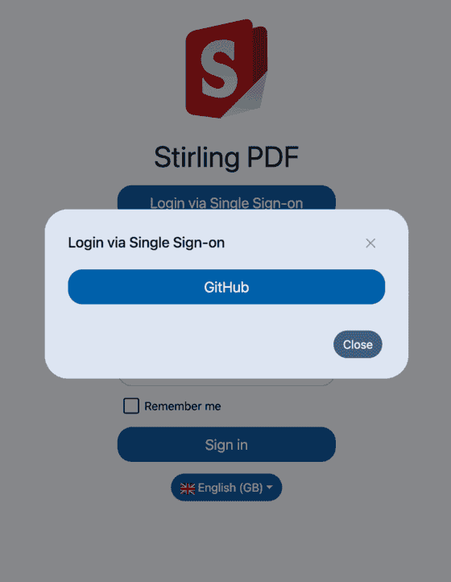

import Tabs from '@theme/Tabs';
import TabItem from '@theme/TabItem';

# Single Sign-On (SSO) Configuration

Stirling-PDF allows login via Single Sign-On (SSO) using OAuth 2 OpenID Connect (OIDC). This allows you to log in to the 
app using an account you may have with another provider such as Google or GitHub. 

## OAuth 2 Set Up
To enable OAuth 2 in Stirling-PDF there are a number of properties you must set. Begin by setting `security.enableLogin` 
to `true` and `security.loginMethod` to `oauth2` in your `/configs/settings.yml`.

```yaml
security:
  enableLogin: true
  ...
  loginMethod: <all|normal|oauth2|saml2>
```

- `enableLogin`: Set to `true` to enable login
- `loginMethod`: Defines the type of login method that will be used on application start up. The available options are:
  - `all`: Enables all login methods (username/password, OAuth 2, SAML 2). Can be used alternatively to `oauth2`
  - `normal`: Enables the username/password login method
  - `oauth2`: Enables the OAuth 2 login method. Use this if you only want to log in via OAuth 2
  - `saml2`: Enables the SAML 2 login method

Next, you will need to configure the OAuth 2 properties for your chosen provider. Start by setting 
`security.oauth2.enabled` to `true`. Stirling-PDF supports multiple providers, in particular 
[Google](https://console.cloud.google.com/), [GitHub](https://github.com/settings/developers) and [Keycloak](https://www.keycloak.org/). 
You also have the option to use a different provider apart from the aforementioned if you wish.

> #### ⚠️ Note
> _The `enableLogin` property must be set to `true` for this to work._

<Tabs groupId="provider-configs">
  <TabItem value="google" label="Google">
    ```yaml
    oauth2:
      enabled: true
      client:
        google:
          clientId: <YOUR_CLIENT_ID>
          clientSecret: <YOUR_CLIENT_SECRET></YOUR_CLIENT_SECRET> 
          scopes: https://www.googleapis.com/auth/userinfo.email, https://www.googleapis.com/auth/userinfo.profile # scopes for Google OAuth2
          useAsUsername: email
      provider: google
    ```
  </TabItem>
  <TabItem value="github" label="GitHub">
    ```yaml
    oauth2:
      enabled: true
      client:
        github:
          clientId: <YOUR_CLIENT_ID>
          clientSecret: <YOUR_CLIENT_SECRET>
          scopes: read:user
          useAsUsername: email 
      provider: github
    ```
  </TabItem>
  <TabItem value="keycloak" label="Keycloak">
    ```yaml
    oauth2:
      enabled: true
      client:
        keycloak:
          issuer: <YOUR_ISSUER_URI>
          clientId: <YOUR_CLIENT_ID>
          clientSecret: <YOUR_CLIENT_SECRET>
          scopes: openid, profile, email
          useAsUsername: email
      provider: keycloak
    ```
  </TabItem>
  <TabItem value="other" label="Other">
    _Using Authentik for example:_
    ```yaml
    oauth2:
      enabled: true
    issuer: <YOUR_ISSUER_URI> 
    clientId: <YOUR_CLIENT_ID>
    clientSecret: <YOUR_CLIENT_SECRET>
    autoCreateUser: true
    blockRegistration: false
    useAsUsername: email
    scopes: openid, profile, email
    provider: authentik
    ```
  </TabItem>
</Tabs>

- `security.oauth2.enabled` Set this to `true` to enable login
- `security.oauth2.issuer` Set this to any provider that supports an OpenID Connect Discovery `/.well-known/openid-configuration` endpoint
- `security.oauth2.clientId` Client ID from your provider
- `security.oauth2.clientSecret` Client Secret from your provider
- `security.oauth2.autoCreateUser` Set this to `true` to allow auto-creation of non-existing users
- `security.oauth2.blockRegistration`: Set to `true` to deny login with SSO without prior registration by an admin
- `security.oauth2.useAsUsername`: The value from the provider to use as the username for the application. Check with your
provider for specific options
- `security.oauth2.scopes`: Specifies the scopes for which the application will request permissions
- `security.oauth2.provider`: The name of the provider

After the OAuth 2 login is enabled, a new button shows up on the login page as per the screenshot below:


Clicking the button will present you with the login for your provider of choice. Once you have clicked the button, 
you will be redirected to your provider in order to login and authorise Stirling-PDF: 


## SAML 2 Set Up
The Callback URL (Redirect URL) for entering in your IdP is:  `https://<striling-pdf.yourdomain>/login/oauth2/code/<oidc-provider>` eg `https://<striling-pdf.yourdomain>/login/oauth2/code/keycloak`
It is highly recommended to use a SSL-enabled reverse-proxy, if the application is going to be exposed to the internet.

## Configurations Examples

<Tabs groupId="config-methods">
  <TabItem value="settings" label="Settings File">
    ```yaml
    security:
      enableLogin: true # set to 'true' to enable login
      oauth2:
        enabled: false # set to 'true' to enable SSO login
        issuer: "" # OpenID Connect Discovery endpoint
        clientId: "" # Client ID from your provider
        clientSecret: "" # Client Secret from your provider
        autoCreateUser: false # auto-creation of users
    ```
  </TabItem>
  <TabItem value="local" label="Local Environment">
    ```bash
    export DOCKER_ENABLE_SECURITY=true
    export SECURITY_ENABLE_LOGIN=true
    export SECURITY_OAUTH2_ENABLED=true
    export SECURITY_OAUTH2_AUTOCREATEUSER=false
    export SECURITY_OAUTH2_ISSUER="<issuer-url>"
    export SECURITY_OAUTH2_CLIENTID="<client-id>"
    export SECURITY_OAUTH2_CLIENTSECRET="<client-secret>"
    ```
  </TabItem>
  <TabItem value="docker-run" label="Docker Run">
    ```bash
    -e DOCKER_ENABLE_SECURITY=true \
    -e SECURITY_ENABLE_LOGIN=true \
    -e SECURITY_OAUTH2_ENABLED=true \
    -e SECURITY_OAUTH2_AUTOCREATEUSER=false \
    -e SECURITY_OAUTH2_ISSUER="<issuer-url>" \
    -e SECURITY_OAUTH2_CLIENTID="<client-id>" \
    -e SECURITY_OAUTH2_CLIENTSECRET="<client-secret>" \
    ```
  </TabItem>
  <TabItem value="docker-compose" label="Docker Compose">
    ```yaml
    environment:
      DOCKER_ENABLE_SECURITY: true
      SECURITY_ENABLE_LOGIN: true
      SECURITY_OAUTH2_ENABLED: true
      SECURITY_OAUTH2_AUTOCREATEUSER: false
      SECURITY_OAUTH2_ISSUER: "<issuer-url>"
      SECURITY_OAUTH2_CLIENTID: "<client-id>"
      SECURITY_OAUTH2_CLIENTSECRET: "<client-secret>"
    ```
  </TabItem>
</Tabs>

# Disable Form Login

Once you successfully enabled Single Sign-on (with OAuth2 or SAML), you might want to disable the form login.
This can be done by changing the ``loginMethod`` setting accordingly to your needs, like so:
## Configurations Examples
<Tabs>
  <TabItem value="settings" label="Settings File">
    ```yaml
    security:
      ...
      loginMethod: oauth2 # Accepts values like 'all' and 'normal'(only Login with Username/Password), 'oauth2'(only
    ```
  </TabItem>
  <TabItem value="docker-run" label="Docker Run">
    ```bash
    -e SECURITY_LOGINMETHOD="oauth2" # to enable oauth2 only
    ```
  </TabItem>
  <TabItem value="docker-compose" label="Docker Compose">
    ```yaml
    environment:
      ...
      SECURITY_LOGINMETHOD: "oauth2" # to enable oauth2 only
    ```
  </TabItem>
</Tabs>
