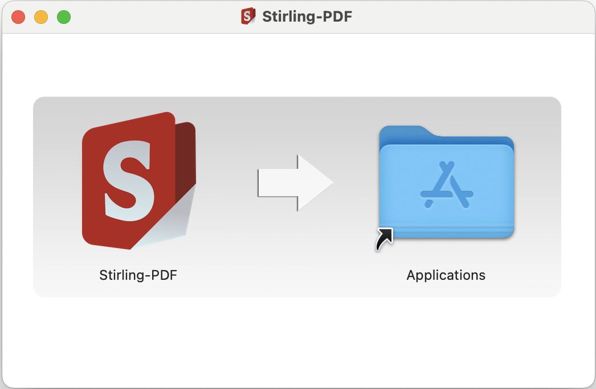
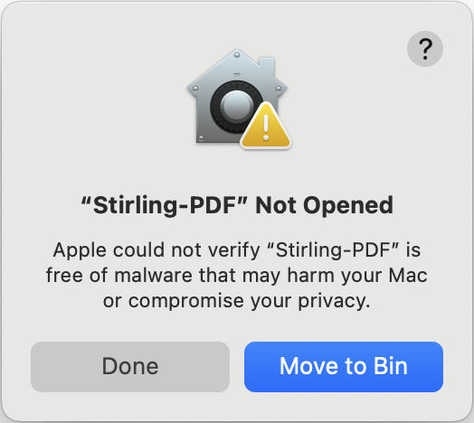
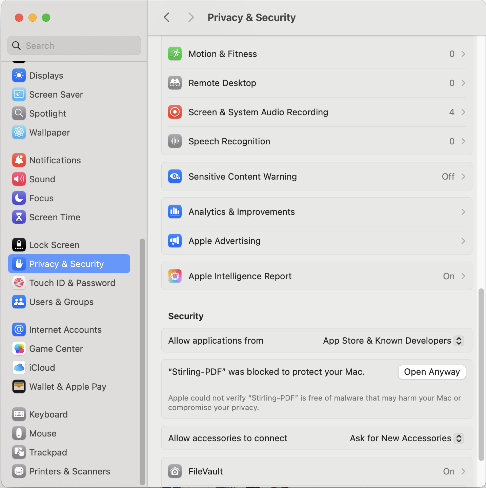

 # MacOS Installation Guide for Stirling PDF

Stirling PDF can be run on MacOS either by using the `.dmg` installer or directly from the `.jar` file.

### Prerequisites:
- Java 17 or 21 (_21 preferred_)
    - Install via Homebrew: `brew install openjdk@21`

## Running via the installer
| [Apple Silicon chips](https://files.stirlingpdf.com/mac-installer.dmg) | [Intel chips](https://files.stirlingpdf.com/mac-x86_64-installer.dmg) |
|------------------------------------------------------------------------|-----------------------------------------------------------------------|

Download the `.dmg` file and follow the instructions to install the app. A window should pop up allowing you to copy the 
app to your Applications folder.



The app should now be located in Applications. Head to your Applications folder to open the app. When you open the app 
for the first time, it will be blocked by MacOS because it has not been officially verified by Apple yet. 



This is only temporary but in the meantime, open System Settings and go to Privacy & Security and then scroll down to the 
Security section. You should see the same message indicating the app being blocked. Click 'Open Anyway', you may be 
prompted to enter your password to allow the app. Once you have done this, head back to Applications and open the app 
again. It should open with no issue this time.



## Running via the `.jar` file
Download the `.jar` file [here](https://files.stirlingpdf.com/Stirling-PDF.jar).
1. Open Terminal
2. Navigate to the folder containing the JAR:
   ```bash
   cd /path/to/folder/containing/jar
   ```
3. Run the JAR file:
   ```bash
   java -jar Stirling-PDF.jar
   ```

_For convenience, you can create a simple script:_
1. Create a file named run-stirling.sh and add the following contents:
   ```bash    
   #!/bin/bash    
   cd /path/to/folder/containing/jar
   java -jar Stirling-PDF.jar
   ```
2. Make it executable:
   ```bash
   chmod +x run-stirling.sh
   ```
3. Run it with:
   ```bash
   ./run-stirling.sh
   ```


### Optional Dependencies
Install these via [Homebrew](https://brew.sh/) to enable additional features like advanced document conversion or PDF compression:

 ```bash
 # Install Homebrew if needed
 /bin/bash -c "$(curl -fsSL https://raw.githubusercontent.com/Homebrew/install/HEAD/install.sh)"

 # Install dependencies as needed
 brew install openjdk@21          # Required
 brew install qpdf                # PDF compression
 brew install --cask libreoffice  # Document conversion
 brew install tesseract           # OCR functionality
 brew install tesseract-lang      # Additional OCR languages
 brew install poppler             # PDF to HTML conversion
 pip3 install weasyprint          # URL to PDF conversion
 pip3 install unoserver           # File to PDF conversion
 ```

For Tesseract OCR, add to `config/settings.yml` (generated once you first run the jar):

```yaml
system:
  tessdataDir: /usr/local/share/tessdata
```

 ## Quick Troubleshooting
 - Java not found? Add to `~/.zshrc`:
   ```bash
   export PATH="/usr/local/opt/openjdk@21/bin:$PATH"
   ```
 - Verify installations with: `[command] --version` (e.g., `java --version`)
 - LibreOffice issues? Ensure no LibreOffice processes are running
 - Need help? Visit [GitHub Issues](https://github.com/Stirling-Tools/Stirling-PDF/issues)

### Starting unoserver alongside Stirling PDF

To ensure that unoserver is running alongside Stirling PDF, you need to start it with the following command:

```bash
unoserver --port 2003 --interface 0.0.0.0
```

You can add this command to your startup script or systemd service file to ensure it starts automatically with Stirling PDF.

